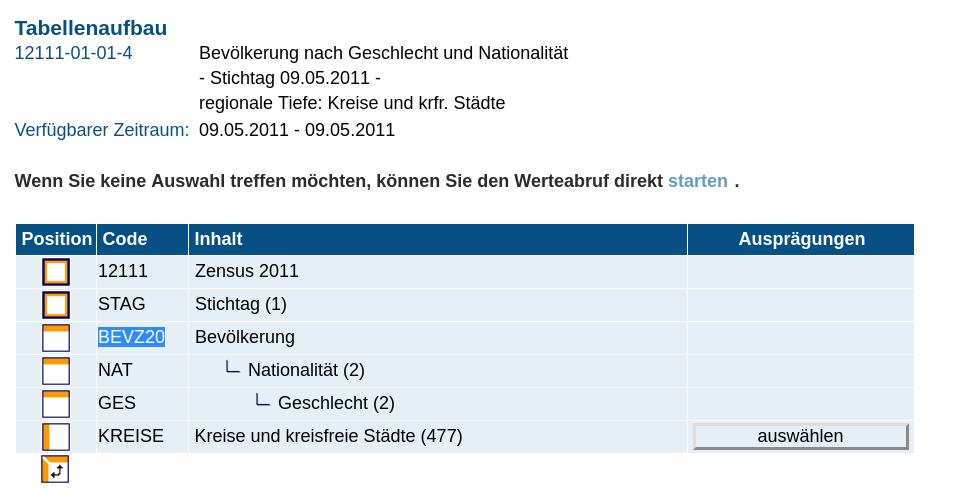
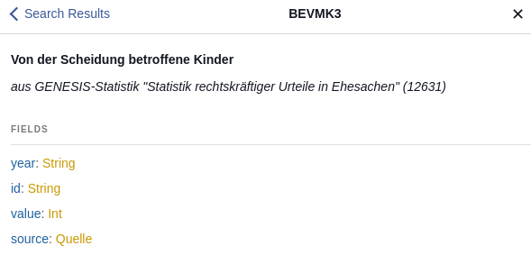

# Api-Docs

## How does GENESIS see the data?

GENESIS
Frontent (Like at https://www.regionalstatistik.de/genesis/online/ )
- subject
    - statistics
        - table

Backend (Data structure that lies behind):

FACT
- value
- region
- time
- attribute ('Merkmal')
    - argument ('Ausprägung')
        - gender = M
        - age = 20

## How to query api.genesapi.org?

You can find the dataguide gui for graph-ql queries here:

http://api.genesapi.org/

The data is modelled in a tree-ish nested structure and so is the querying via GraphQL.
Data is stored in nested key-value pairs.

A query will look like this:

```
{
   region(id:"07131") {
    name
    LBZ001(GESMF: "GESMF01" ELEGP1: "ELEGPLUS1") {
      value
      year
      GESMF
      QUARTG
      ERW122
      ELEGP1
    }
  }
}
```

Live Example: [Number of men receiving parental benefit plus in Ahrweiler ](http://api.genesapi.org/?query=%7B%0A%20%20%20region(id%3A%2207131%22)%20%7B%0A%20%20%20%20name%0A%20%20%20%20LBZ001(GESMF%3A%20%22GESMF01%22%20ELEGP1%3A%20%22ELEGPLUS1%22)%20%7B%0A%20%20%20%20%20%20value%0A%20%20%20%20%20%20year%0A%20%20%20%20%20%20GESMF%0A%20%20%20%20%20%20QUARTG%0A%20%20%20%20%20%20ERW122%0A%20%20%20%20%20%20ELEGP1%0A%20%20%20%20%7D%0A%20%20%7D%0A%7D
)

In your query you'll need to specify:
1. a region
2. the attribute (Merkmal) you're interested in, arguments (Ausprägungen) for this attribute like male/female or German/non-German and the time-period (year)

## 1. Region

Let's talk about regions (districts) first:

### List endpoint

Live Example: [List all regions (german states and districts)](http://api.genesapi.org/?query=%7B%0A%20%20regions%20%7B%0A%20%20%20%20id%0A%20%20%20%20name%0A%20%20%7D%0A%7D)
```
{
  regions {
    id
    name
  }
}
```

### arguments
To filter this list of regions, these filter arguments are implemented:

- nuts: filter by [nuts level](https://en.wikipedia.org/wiki/Nomenclature_of_Territorial_Units_for_Statistics):

    - nuts: 1 - Bundeländer
    - nuts: 2 - Regierungsbezirke / Statistische Regionen
    - nuts: 3 - Landkreise

Live Example: [List all german states](http://api.genesapi.org/?query=%7B%0A%20%20regions(nuts%3A%201)%20%7B%0A%20%20%20%20id%0A%20%20%20%20name%0A%20%20%7D%0A%7D)

```
{
  regions(nuts: 1) {
    id
    name
  }
}
```

- parent: filter by regions from its parent id
<!--- Are we still using this?
- deprecated: true for regions that are not valid anymore (because of "Kreisgebietsreformen")
- valid: not deprecated
--->

Live Example: [List all districts in North-Rhine Westphalia](http://api.genesapi.org/?query=%7B%0A%20%20regions(parent%3A%20%2205%22%2C%20nuts%3A%203)%20%7B%0A%20%20%20%20id%0A%20%20%20%20name%0A%20%20%7D%0A%7D%0A)
```
{
  regions(parent: "05", nuts: 3) {
    id
    name
  }
}
```

### detail endpoint
Using the detail endpoint you can ask for a specific city by id-argument.

Live Example: [Query a specific city](http://api.genesapi.org/?query=%7B%0A%20%20region(id%3A%2205911%22)%20%7B%0A%20%20%20%20id%0A%20%20%20%20name%0A%20%20%7D%0A%7D%0A)
```
{
  region(id:"05911") {
    id
    name
  }
}
```

## 2. Attribute ('Merkmal') and arguments ('Ausprägungen')
If you want to query a region for a specific attribute, you'll use the original attributes from the GENESIS-Databases:

[List of available attribute](https://www.regionalstatistik.de/genesis/online/data;jsessionid=9F06C17BBD2FA90DD5326938DD00EF24.reg1?operation=merkmaleVerzeichnis) on 'Regionalstatistik')

Alternativly go to [https://www.regionalstatistik.de] and search for the table you want.

You'll find this view:



3. The code in blue is the attribute ('Merkmal') your are looking for.

For each attribute, you'll have to specify the arguments ('Ausprägungen') like nationality (German/non-German), gender (male/female) and time-period (year):

Live example: [Number of children affected by divorce in Bochum]()

```
{
  region(id:"05911") {
    id
    name
    	BEVMK3 (year:"2016"){
    value
    year
    }
  }
}
```

## Docs-Tab on api.genesapi.org

There is a Docs-tab on the genesapi-gui: In there you can look up attribute-codes to get some general information and the list of associated arguments:


