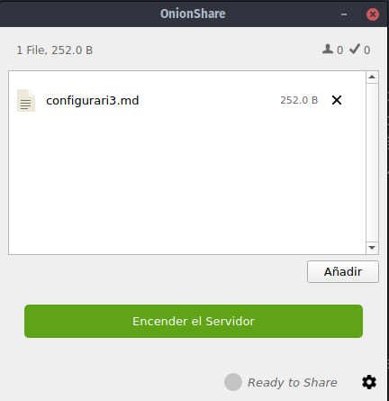
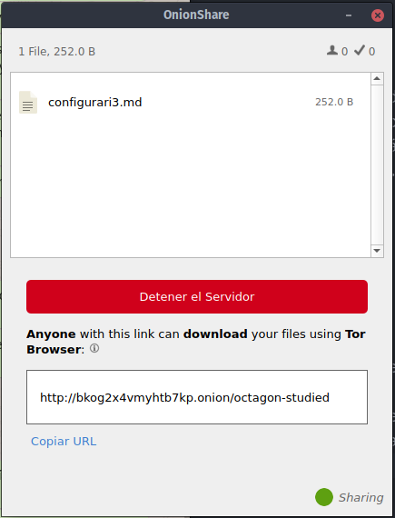
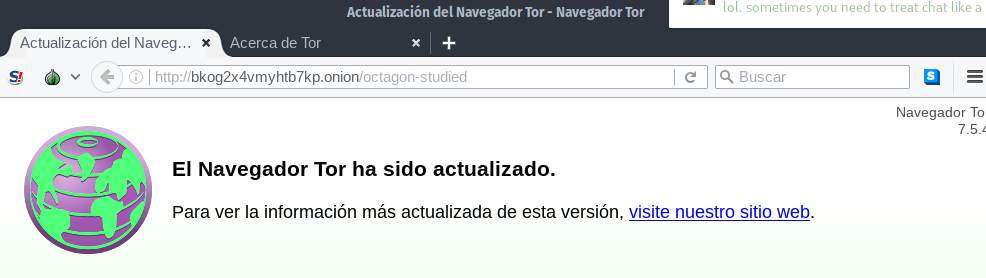
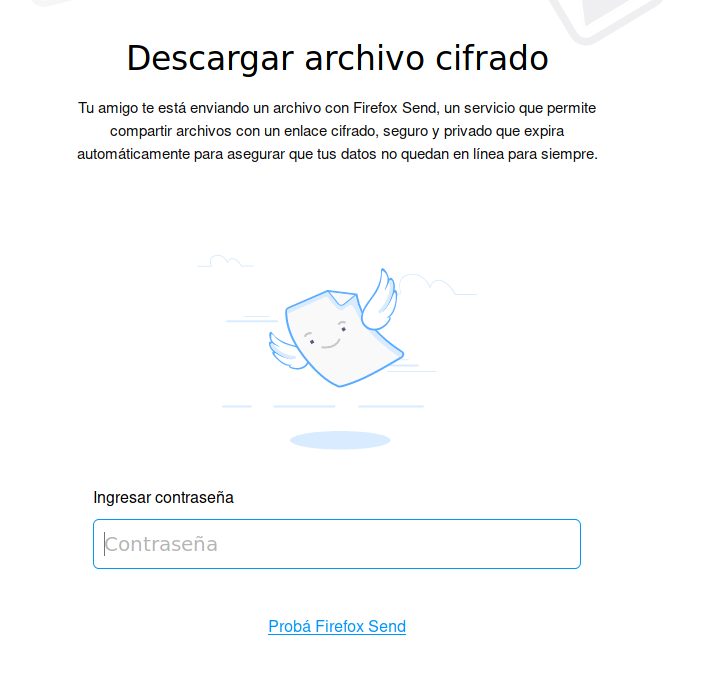
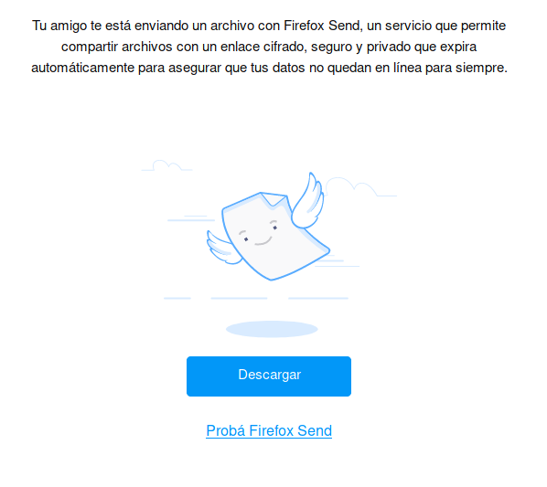

# ¿Cómo compartir archivos de forma segura y anónima?

Muchas veces tenemos la necesidad de enviarle archivos a otrxs personas. Si los enviamos por correo electrónico o usando las herramientas más comunes de chat, dejamos rastros aún si el archivo está cifrado.

## OnionShare

Utilizando las herramientas que nos brinda el proyecto TOR, podemos utilizar [onionshare]() que nos permite enviarle el archivo a otra persona sin que pase por la *nube*. Es decir que siempre estará en tu equipo y la otra persona lo descargará directamente desde allí.

### Paso a paso

1) Ingresá al sitio de [onionshare](https://onionshare.org/) y descargá el software para tu sistema operativo.

2) Una vez descargado deberás instalarlo.
3) Cuando lo abras, verás que lo primero que hace es conectarse a la red TOR.
4) Agregamos el archivo que queremos enviar arrástrandolo desde el **Administrador de archivos** de nuestro sistema operativo o haciendo clic en el botón **Añadir**
5) Una vez que hayamos agregado el o los archivos que querramos enviar, tendremos que hacer clic en el botón verde que aparece debajo para *Encender el servidor*

6) En cuanto las conexiones se hayan realizado, nos aparecerá un enlace (de muchas letras y números) y un botón en rojo para que podamos *Detener el servidor* una vez que no querramos compartir más el archivo. Debajo del *link* tenemos un botón que dice *Copiar URL*, hacemos clic y ya tendremos el enlace listo para compartir.

7) El enlace al ser un **.onion** solo puede ser abierto con un navegador **TOR**.

8) Desde el navegador **TOR** la persona que reciba el enlace podrás ver los archivos que puede descargar.
9) De forma predeterminada, **onionshare** solo permite una descarga del archivo y después inutiliza el enlace. De esa forma nos aseguramos que si alguien logra acceder al mismo, igual no podrá descargar el archivo.

## Firefox Send

Esta es otra herramienta útil si queremos tener algunos niveles de protección del archivo que estamos enviando. Funciona desde la *web* y el enlace es solo válido por 24 horas o una descarga, lo que ocurra primero. El archivo además se cifra automáticamente antes de ser enviado a la *nube*, de esa forma ni siquiera la organización que brinda el servicio puede saber qué contiene el archivo (aunque posiblemente pueda conocer otro meta información).

### Paso a paso

1) Ingresar al sitio [send.firefox.com](https://send.firefox.com/)
2) Podemos agregar archivos usando el botón **Seleccioná un archivo para subir** o arrastrándolo desde el *Administrador de archivos* hasta el espacio delimitado con una línea de puntos
3) Una vez subido el archivo, tendremos la opción de configurar la cantidad de descargas posibles (de 1 a 20) y si solicitamos una contraseña para permitir la descarga
4) Nos da un enlace y un botón para copiarlo al portapapeles de nuestro sistema operativo
5) La persona a la que le pasemos nuestro enlace, podrá abrirlo con cualquie navegador
6) Si solicitamos una contraseña, deberán ingresarla:

7) Si no la solicitamos o una vez que la ingresan, tendrán un botón desde el cuál descargar el archivo

## Diferencias entre ambos servicios
