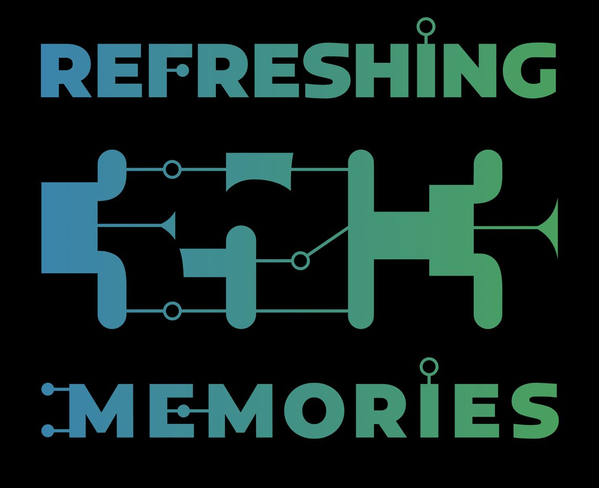

Wie in jedem Jahr findet auch 2018 zwischen Weihnachten und Silvester der [Chaos Communication Congress](https://events.ccc.de/congress/2018/) statt, der größte Hacker-Kongress Europas. In diesem Jahr treffen sich 16.000 Hacker\*innen, Aktivist\*innen, Künstler\*innen und andere Technikinteressierte in Leipzig um gemeinsam zu lernen, zu feiern und über technische und gesellschaftliche Fragen zu diskutieren.

Unser Team ist in diesem Jahr mit gleich zwei Programmpunkten vor Ort: Am 28.12. um 14:30 Uhr auf der [ChaosZone-Bühne](https://35c3.c3nav.de/l/chaoszone-stage/) mit einem [Vortrag zur Technik hinter dem Datenguide-Projekt](https://cfp.chaoszone.cz/35c3/talk/QX9NBX/) und am 30.12. um 13:00 Uhr im [WikiPaka-Orbit](https://35c3.c3nav.de/l/wikipaka-dining/details/) mit einer [zweiten Session](https://cfp.verschwoerhaus.de/35c3/talk/RGU9XL/) für alle, die mehr über amtliche Statistik, Open Data und aktuelle Entwicklungen beim Datenguide erfahren möchten.

Für das Datenguide-Projekt sind [Patricia](https://twitter.com/pen1710) und [Simon](https://twitter.com/sjockers) beim Congress unterwegs. Sagt hallo und sprecht mit uns über Statistiken, Open Data und Datenjournalismus!
