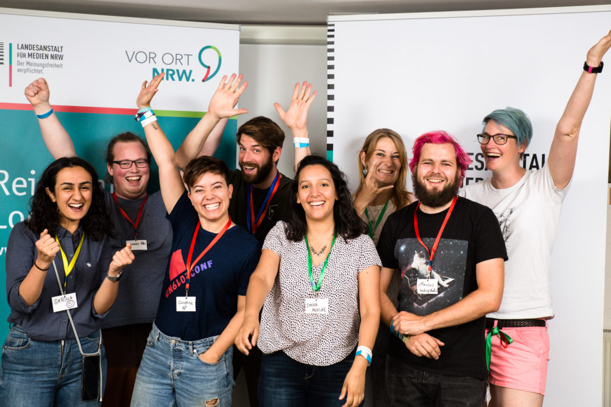
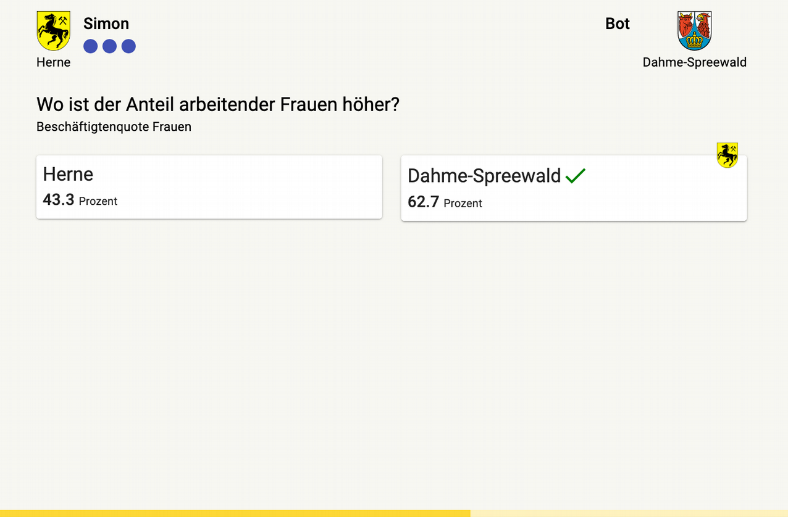
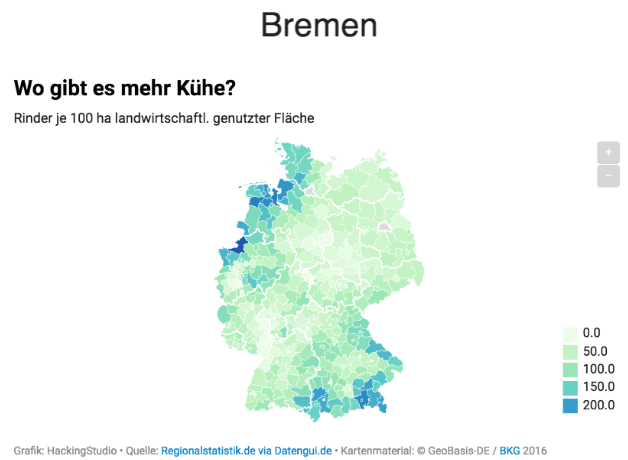

Rund 40 Teilnehmer:nnen waren vom 5. bis 7. Juli 2019 im Essener Unperfekthaus beim Journalismus-Hackathons dabei. Ziel: In 48 Stunden Ideen und Prototypen entwickeln, die der Medienbranche und ihren Akteuren neue Impulse liefern. Veranstalter des Hackathons war das [Journalismus-Lab](https://www.journalismuslab.de/) der Landesanstalt für Medien NRW, in Kooperation mit dem [Barcamp Ruhr](https://www.barcamp.ruhr/).

<small>
  Das Gewinner-Team: Sarina Sam (Freie Designerin), Mary Hochholzner (Nürnberger
  Nachrichten) und Jimena Aguilar (Freie Autorin für Online-Konzepte). Christian
  Jörres, Christine Gotthardt, Marcus Weiner, Jannes Höke, Patricia Ennenbach
  (alle frei beim WDR hacking.studio, einem Kollektiv von freien
  Journalist*innen, Programmierer*innen und Designer*innen). Foto: Christian
  Herrmann / Journalismus Lab.
</small>

---

Der heimliche Star dabei: Die Datenguide-API. Der Gewinnerprototyp ‘Revierderby’ ist ein location based newsgame. Spielidee: Nutzer:innen geben ihren Namen und ihre Stadt an und bekommen eine Gegner:in aus einer anderen Stadt zugelost. Dann kommen Schätzfragen: Wo gibt es mehr Waldfläche? In Köln oder in Bamberg? Wo mehr Kühe? Wo mehr Beamte? Mehr Arbeitslose?
Alle diese Daten liegen in Regionalstatistik.de als normierte Werte (zum Beispiel pro 1.000 EinwohnerInnen oder pro Hektar) vor und konnten über die Datenguide-API abgerufen und schnell aufbereitet werden.

### Schätzfragen zur Regionalstatistik

**[Revierderby spielen](https://revierderby.hacking.studio)**

### Automatisch generierte Karten als Antwort

Als Auflösung bekommen die Nutzer:innen im Revierderby automatisch generierte Karten für ganz Deutschland (Datenjournalismus) und potentielle News-Partner haben die Chance, ihren Content zu verlinken. Zum Beispiel, wenn die Lokalredaktion gerade über Arbeitslose vor Ort berichtet hat.
Ziel ist es, dass Redaktionen das Gemeinschaftsgefühl in ihren Community stärken können (Köln gegen Bamberg) und anhand der Klicks im Game auch etwas über die Interessen und das Vorwissen ihrer Nutzer:innen erfahren.

### Erfahrungen mit Newsgames sammeln

Das Ganze ist ein spielerischer Usecase und zeigt, dass mit Datenguide statistische Daten für Journalist:innen leichter zugänglich gemacht werden. Beim Hackday konnten wir Erfahrungen mit der Schnittstelle sammeln. Der Mehrwert bei Hackathons besteht ja in der Vernetzung, dem gemeinsamen Lernen und den Ausprobieren neuer Technologien. In der Heimatredaktion kann dieses Wissen dann für Weiterentwicklungen Folge-Ideen genutzt werden.

Weiterführende Links:

- [Revierderby bei Github](https://github.com/hackingstudio/locationbased-newsgame)
- [Gesamte Revierderby Präsentation](https://docs.google.com/presentation/d/1vELWMovUadKngMH6rrAGuOCKfwApN07Hf1kDvwgIaWk/edit?usp=sharing)
- [Nachbericht Hackathon LfM NRW](https://www.journalismuslab.de/2019/05/02/hackathon-hacking-local_media/)
