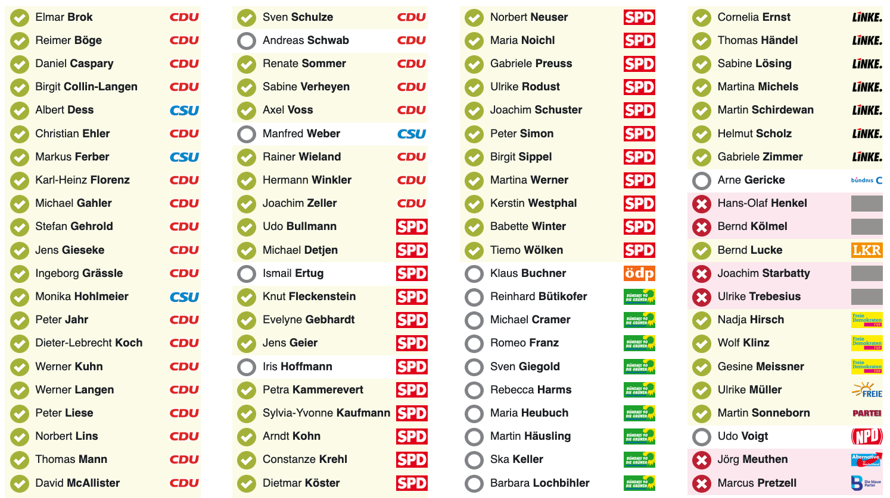
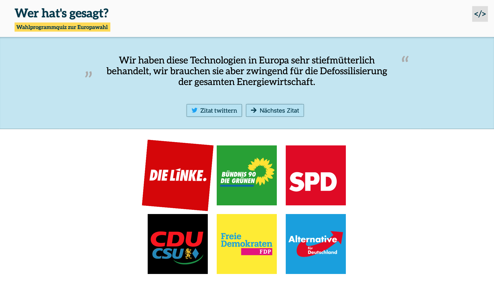
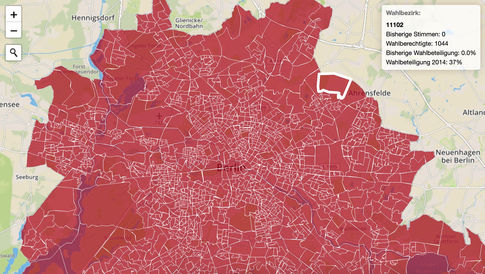

import ArrowLink from '../../../../components/ArrowLink'

Beim [Wahlsalon 2019](/wahlsalon) brachten wir für ein Wochenende Aktive und Interessierte aus Zivilgesellschaft, Journalismus und Verwaltung zusammen, um gemeinsam an Hacks und Prototypen rund um die Themen Wahlen, Politik und Open Data zu arbeiten. Ziel war es, demokratische Prozesse transparenter und zugänglicher zu machen. Dabei waren rund 30 Hacker\*innen, Journalist\*innen, Designer\*innen, Statistiker\*innen, und Politik-Nerds aus ganz Deutschland.

Zum Auftakt des Wahlsalons gab es kurze Vorträge von [Kira Schacht](https://twitter.com/daten_drang) (Journocode), die ihre Arbeit als Datenjournalistin vorstellte und [Heidrun Stirner](https://twitter.com/StirnerHeidi) (Destatis), die eine Übersicht über aktuelle Entwicklungen bei den Statistischen Ämtern gab. [Daniel Kraft](https://twitter.com/dk_kraft) vom Mannheimer Morgen sprach über die Sorgen und Nöte von Lokaljournalisten bei der Wahlberichterstattung. Daniel stellte außerdem ein Vorschlag vor, mit dem er und seine Kolleg\*innen von DDJBW, die Veröffentlichung von Wahlergebnissen verbessern wollen: [Für offene Wahldaten noch am Wahlabend](http://ddjbw.de/2019/03/12/fuer-offene-wahldaten-noch-am-wahlabend/)

Im Anschluss an die Vorträge stellten Teilnehmer\*innen Ideen vor und bildeten Teams, in denen Sie bis Sonntagnachmittag ganz verschiedene Fragestellungen bearbeiteten. Hier eine Nachlese zu den Ergebnissen der Veranstaltung.

### Abstimmungsverhalten im Europaparlament

Lisa Charlotte Rost, Stefan Wehrmeyer und Jochen Klar arbeiteten daran, das Abstimmungsverhalten der EU-Parlamentarier zu visualisieren. Ihr Projekt ist inspiriert durch die Visualisierungen der Parlamentsabstimmungen, die Martin Sonneborn auf Twitter populär gemacht hat. Ihr Ergebnis ist ein Tool, das automatisch Abstimmungsergebnisse aus den offiziellen Veröffentlichungen des Europäischen Parlaments extrahiert und in einer Rasterdarstellung visualisiert.

<ArrowLink href="https://observablehq.com/@stefanw/parsing-eu-parliament-vote-pdfs">
  Visualising EU Parliament Vote PDFs (Observable Notebook)
</ArrowLink>
<ArrowLink href="https://github.com/jochenklar/meps">
  Skripte zum extrahieren der Daten (Source Code)
</ArrowLink>

### Parteiprogramme zur Europawahl

Das nächste Projekt ist ein schönes Beispiel dafür, wie Kooperation durch open source aussehen kann: Sebastian Schröder und Marco Holz erarbeiteten ein [Wahlprogramm-Quiz für die Europawahl](https://wahlprogrammquiz.de). Ihr Quiz baut auf einem älteren Projekt auf, das ursprünglich für die letzte Bundestagswahl entwickelt wurde. Die Texte der Wahlprogramme, die Sebastian und Marco für ihr Quiz gesammelt und aufbereitet haben, bildeten später die Basis für eine [Datenanalyse von Johannes Filter](https://twitter.com/fil_ter/status/1122798508317265920). In dieser erstellt Johannes eine Rangliste der am häufigsten verwendeten Worte in den Wahlprogrammen der deutschen Parteien.

<ArrowLink href="https://wahlprogrammquiz.de">Wahlprogramm-Quiz</ArrowLink>
<ArrowLink href="https://github.com/codedust/wahlsalon19-werhatsgesagt">
  Wahlprogramm-Quiz (Source Code)
</ArrowLink>
<ArrowLink href="https://github.com/basti-schr/eu-wahlprogramme">
  Maschinenlesbare Wahlprogramme der Europawahl 2019
</ArrowLink>
<ArrowLink href="https://github.com/jfilter/most-frequent-words-2019-german-eu-election-programs">
  Ranking der häufigsten Worte in den Wahlprogrammen
</ArrowLink>

### Wahlbeteiligung und andere regionale Statistiken

Ein Team um Alexandra Kapp und Lisa Hehnke von CorrelAid entwickelten einen Prototyp für eine interaktive Anwendung, die die Wahlbeteiligung bei der letzten Europawahl auf einer Karte darstellt und auf der Nutzer\*innen ihre Wahlabsicht bei der Wahl 2019 veröffentlichen können.

Gleichzeitig arbeiteten Christian Rijke und Simon Wörpel von Datenguide an Tools, die es einfacher machen, über die Datenguide-API mit Daten der amtlichen Statistik zu arbeiten. Mit diesen Tools können Entwickler\*innen und Datenjournalist\*innen schneller auf historische Wahldaten und andere regionale Statistiken zugreifen.

<ArrowLink href="https://github.com/AlexandraKapp/eu-wahlbeteiligung">
  Prototyp Wahlbeteiligung (Source Code)
</ArrowLink>
<ArrowLink href="https://github.com/crijke/datenguideguide">
  Grafische Benutzeroberfläche für die Datenguide API (Source Code)
</ArrowLink>
<ArrowLink href="https://github.com/datenguide/datenguide-wdc">
  Web Data Connector um Datenguide in Tableau zu nutzen (Source Code)
</ArrowLink>

Aus dem Kontakt zwischen CorrelAid und Datenguide entstand die Idee, gemeinsam weiter daran zu arbeiten, die Datenschnittstelle von Datenguide besser mit den Programmiersprachen R und Python nutzbar zu machen. Inzwischen gibt es einen Aufruf, sich an diesem Projekt zu beteiligen: [Macht mit!](https://mailchi.mp/14a8f1458fca/correlaid-projektausschreibung-datenguide)

### Die Demographie des Brandenburger Landtags

Im Superwahljahr 2019 stehen nicht nur Europawahlen an, sondern auch Landtagswahlen in verschiedenen Bundesländern. Ein Team um Daniel Kraft, Stefanie Schweller, Andrea Knabe-Schönemann und Simon Jockers betrachtete beispielhaft den Brandenburger Landtag und verglich anhand amtlicher Statistiken, wie gut (oder wie schlecht) die Demographie der Landtagsabgeordneten die Brandenburger repräsentiert. Mehr zu diesem Projekt gibt es in einigen Wochen hier im Blog.

---

Der Wahlsalon 2019 war ein gemeinsames Projekt von [Datenguide](/) und [Code for Germany](https://codefor.de). Die Veranstaltung wurde unterstützt von [Wikimedia Deutschland](https://wikimedia.de/) und dem [MIZ Babelsberg](https://www.miz-babelsberg.de/).
