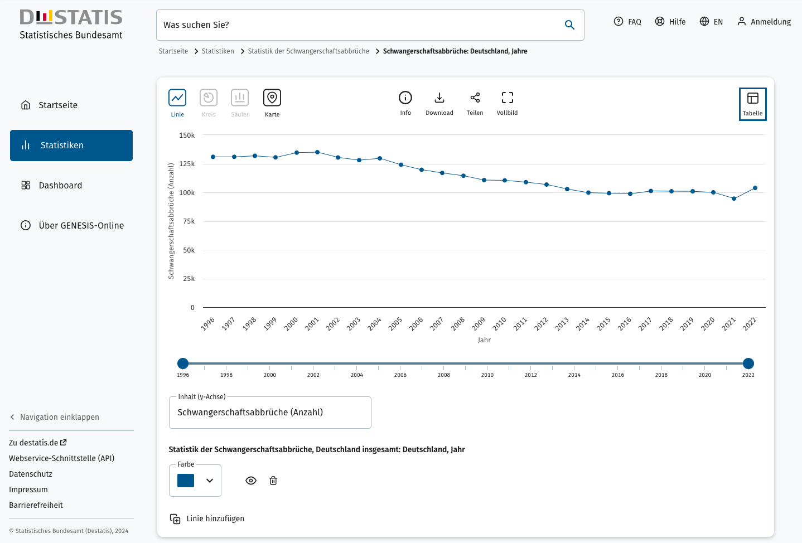

import ArrowLink from '../../../../components/ArrowLink'

Im Rahmen des Projekts [Datenguide](/) haben wir uns seit 2017 damit beschäftigt, den Zugang zu amtlichen Statistiken zu verbessern. In dieser Zeit sind verschiedene Open-Source-Tools entstanden, die dabei helfen, statistische Daten aus den offiziellen Datenportalen der statistischen Ämter herunterzuladen und weiterzuverwenden. Diese Tools haben wir dafür eingesetzt, eine alternative Datenschnittstelle (API) für die [Regionaldatenbank Deutschland](https://www.regionalstatistik.de/genesis/online/) zur Verfügung zu stellen – die Datenguide-API.

Über die Datenguide-API konntet ihr bisher per [GraphQL](https://github.com/datenguide/api) und [REST](https://datengui.de/docs/rest) auf die Inhalte der Regionaldatenbank zugreifen. **Diese Schnittstellen werden wir zum 15. Juni 2024 abschalten.** Auch Tools, die auf diese Schnittstellen zugreifen, werden nach dem 15. Juni nicht mehr verwendbar sein. Dazu zählt unser [experimentelles Datenportal](/statistiken) aber auch die [Python-](https://datenguidepy.readthedocs.io/en/latest/) und [R-Bibliotheken](https://github.com/CorrelAid/datenguideR), die auf der Datenguide-API aufbauen.

## Das Problem, das wir lösen wollten

Die statistischen Ämter des Bundes und der Länder betreiben verschiedene offizielle Datenportale, über die sie ihre Statistiken veröffentlichen. Eines dieser Portale ist die bereits genannte _Regionaldatenbank Deutschland_. Dort findest du „tief gegliederte“ Statistiken, also Daten zu Bundesländern, Landkreisen, Städten und Gemeinden. Diese statistischen Daten sind wichtige Quellen für Politik, Verwaltung und Wissenschaft, aber auch für Journalist:innen und zivilgesellschaftliche Initiativen.

Leider kostet die Nutzung dieser Datenportale einiges an Nerven. Hier eine Auswahl von Problemen, mit der Nutzer:innen in der Vergangenheit zu kämpfen hatten (und teilweise weiterhin haben):

- Tabellen-Downloads als CSV-Dateien waren für die Darstellung in Tools wie Microsoft Excel optimiert. Deshalb mussten sie manuell bereinigt werden, um sie mit gängigen Tools wie R oder Python weiterverarbeiten zu können.
- Es existierte lange keine moderne Schnittstelle, über die Daten z.B. im JSON-Format oder als (brauchbare) CSV-Dateien abgefragt werden könnten. Die vorhandene Datenschnittstelle auf Basis von SOAP war für viele Nutzer:innen nicht praktikabel.
- Der Zugriff auf die SOAP-Schnittstelle war zumindest teilweise kostenpflichtig.
- Der Abruf umfangreicherer Datensätze erfordert einen Login und eine Bestellung der Daten, bevor der Download möglich gemacht wird.
- Session-basierte URLs verhindern, dass Links zu konkreten Datensätze gespeichert oder weitergegeben werden können.

All diese Probleme beschränkten den Zugang auf Informationen, die eigentlich der Allgemeinheit zur Verfügung stehen sollten. Ziel des Datenguide-Projekts war es, diese Hürden abzubauen. Dafür haben wir mit alternativen Datenzugängen experimentiert und Prototypen entwickeln.

### Hintergrund: GENESIS und die Datenguide-API

Datenguide baut auf [GENESIS](<https://de.wikipedia.org/wiki/GENESIS_(Statistik)>) auf, einer technischen Plattform, mit der die statistischen Ämter verschiedene Datenportale betreiben. Dazu zählen die [Regionaldatenbank](https://www.regionalstatistik.de/), die [Datenbank des Statistischen Bundesamts](https://www-genesis.destatis.de/), und die statistischen Datenportale mehrerer Bundesländer. Auch die [ZensusDatenbank](https://ergebnisse2011.zensus2022.de/datenbank/online/), über die in diesem Jahr die Ergebnisse des Zensus 2022 veröffentlicht werden, basiert auf GENESIS.

Die Datenguide-API, die wir seit 2018 öffentlich zur Verfügung gestellt haben, spiegelte die Daten aus der oben genannten Regionaldatenbank, aber die zugrundeliegenden Tools und Techniken könnten grundsätzlich auch auf andere GENESIS-Datenbanken angewendet werden. Die Datenguide-API war der Prototyp einer modernen Datenschnittstelle für den Zugriff auf amtliche Statistiken, als Alternative zu den offiziellen Schnittstellen der statistischen Ämter.

---

## Die Zeiten ändern sich

In den vergangenen Jahren hat sich bei den Datenportalen der statistischen Ämter einiges getan – nicht zuletzt durch den Dialog mit Akteur:innen aus der Datenjournalismus- und Open-Data-Community. So ist die Nutzung der offiziellen Datenschnittstellen schon seit Längerem kostenlos und es gibt inzwischen bessere Möglichkeiten für die technische Weiternutzung der Daten. Ein überarbeitetes Datenformat (_„Flat File CSV“_) und eine API (_„Webservice-Schnittstelle“_), ermöglichen das Abrufen von Statistiken über REST/JSON – direkt aus den offiziellen Datenportalen.

Positiv hervorzuheben ist außerdem die laufende Neugestaltung von GENESIS. Eine aktuelle [Beta-Version des Statistischen Bundesamts](https://www-genesis.destatis.de/datenbank/beta/) zeigt deutliche Verbesserungen bei der Benutzerführung und der Darstellung der Daten. Wir hoffen dass diese Entwicklungen dazu beitragen, dass die Nutzung amtlicher Statistiken in Zukunft einfacher wird.

_Diese [Beta-Version von GENESIS](https://www-genesis.destatis.de/datenbank/beta/statistic/23311/table/23311-0002/chart/line) zeigt, wie die Daten des Statistischen Bundesamts in Zukunft präsentiert werden sollen._

### Ist die Datenguide-API noch notwendig?

Nein. Zwar lösen die aktuellen Schnittstellen der GENESIS-Plattform noch nicht alle Probleme, die wir mit der Datenguide-API addressieren wollten, dennoch empfehlen wir inzwischen die Nutzung dieser offiziellen Schnittstellen. Das überarbeitete CSV-Format der statistischen Ämter („Flat File CSV“) ermöglicht die Weiterverwendung der Daten ohne manuelle Bereinigung und über die offizielle REST-Schnittstelle („Webservice“) können Statistiken mit gängigen Programmiersprachen abgerufen werden. Auch wenn sich ihr Design noch stärker an den Bedarfen der User orientieren könnte, stellen die GENESIS-Portale durchaus brauchbare Werkzeuge dar – [vorausgesetzt man weiß, wie man sie am besten einsetzt](../genesis).

Außerdem existieren inzwischen [inoffizielle GENESIS-Bibliotheken für R](https://github.com/CorrelAid/restatis) und [für Python](https://github.com/CorrelAid/pystatis), die bei der Arbeit mit den Schnittstellen der GENESIS-Portale helfen können. Der Vorteil dieser Tools gegenüber der Datenguide-API ist, dass sie den direkten Zugriff auf amtliche Statistiken aus den offiziellen Quellen ermöglichen. Für die Datenguide-API mussten wir die Daten in der aufwendig spiegeln und auf unserem eigenen Server bereitstellen. Dieser Umweg ist nun nicht mehr notwendig.

<ArrowLink href="../genesis">
  So nutzt du die Datenschnittstellen der statistischen Ämter
</ArrowLink>

### Prototyp oder öffentliche Infrastruktur?

Die Datenguide-API war von Beginn nur als Prototyp angelegt. Die Arbeit an dem Projekt wurde zeitweise durch den [Prototype Fund](https://prototypefund.de/) und das [MIZ Babelsberg](https://www.miz-babelsberg.de/) unterstützt, aber diese Förderungen sind bereits 2020 ausgelaufen und wir betreiben die Datenguide-API seitdem auf eigene Kosten.

Grundsätzlich besteht bei Projekten dieser Art das Problem, dass ehrenamtlich Software entwickelt und betrieben wird, die eigentlich öffentliche Infrastruktur darstellt und von der öffentlichen Hand, mit öffentlichen Mitteln, bereitgestellt werden müsste. Dazu zählt auch, dass diese Infrastruktur so gestaltet sein muss, dass sie wirklich von Bürger:innen genutzt werden kann. Mit dem aktuellen Stand der GENESIS-Datenportale kommen die statistischen Ämter dieser Aufgabe besser nach als in der Vergangenheit. Deshalb haben wir beschlossen, die Datenguide-API abzuschalten.

### Wie geht es weiter?

Wir werden die Datenguide-API am 15. Juni 2024 deaktivieren. Die Datenguide-Website bleibt online zugänglich, um das Projekt zu dokumentieren. Erhalten bleibt insbesondere der Bereich „Statistik erklärt“, der Grundlagen für die Nutzung der amtlichen Statistik vermittelt und unabhängig von der Datenguide-API funktioniert. Der Quellcode für die Open-Source-Tools, die der Datenguie-API zugrunde liegen, ist auf GitHub archiviert.

### Danke an alle!

Das Kernteam von Datenguide bestand aus Christian Rijke, Patricia Ennenbach, Simon Jockers und Simon Wörpel. Danke außerdem an alle, die an der Datenschnittstelle und ihrer Dokumentation mitgearbeitet oder die Entwicklung durch Feedback oder eigene Prototypen unterztützt haben. Das waren unter anderem Tim Fangmeyer, Julia Barthel, Gregor Aisch und Christine Gotthardt. Ein besonderer Dank geht auch an Alexandra Kapp, Fabio Votta, Konrad Wölms, Kristian Stoye, Lisa Hehnke, Veronika Grupp und allen anderen, die bei [CorrelAid](https://www.correlaid.org/) an den Python- und R-Bibiotheken für die Datenguide-API gearbeitet haben.

Wir möchten uns außerdem beim Prototype Fund, dem MIZ Babelsberg und bei Netzwerk Recherche bedanken, die uns zu verschiedenen Zeitpunkten des Projekts unterstützt haben. Ohne eure Hilfe wäre diese Arbeit nicht möglich gewesen. 💛
