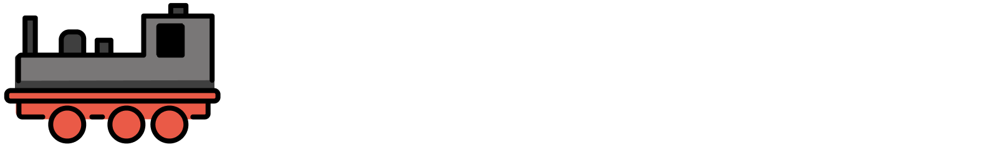
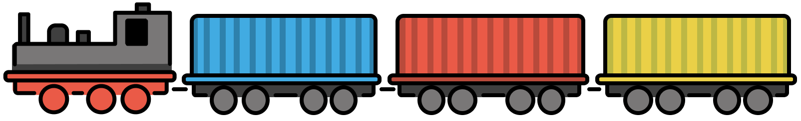

import Button from '@material-ui/core/Button'

# Datenabfrage über REST

Wer Daten nicht händisch über unser [Datenportal](https://datengui.de/statistiken) herunterladen möchte, kann die Datensätze mit Hilfe unserer [experimentellen REST-Schnittstelle](https://tabular.genesapi.org) abfragen. Dafür kannst du die Adresszeile deines Browsers oder eine beliebige Programmiersprache verwenden. Wenn du bereits Erfahrung mit dem Abfragen von APIs hat, kannst du diesen Abschnitt überspringen und direkt bei der [Aufbau der Abfragen](#url-struktur) weiterlesen.

## So funktionieren REST-Abfragen

Hier sind einige Beispiele für die Datenabfrage über REST:

- https://tabular.genesapi.org/?data=12612:BEV001
- https://tabular.genesapi.org/?data=12612:BEV001&amp;level=2
- https://tabular.genesapi.org/?data=12612:BEV001&amp;level=2&amp;time=2008:

Für die Abfrage der REST-Schnittstelle sind keine Programmierkenntnisse notwendig. Jede dieser Adressen
(URLs) kann einfach im Browser geöffnet werden und stellt bereits eine Anfrage an die REST-Schnittstelle von Datenguide dar. Der Browser genügt als „Werkzeug“, um mit der Schnittstelle zu kommunizieren und Daten abzufragen.

Was genau du abfragst, bestimmst du durch durch das Anfügen unterschiedlicher Anhänge an die Adressen, sogenannter Parameter. Damit die Anfrage funktioniert, müssen also alle notwendigen Informationen in die URL untergebracht werden. Dabei sind einige Bestandteile notwendig für die Abfrage, andere optional.

Man kann sich die URL-Abfrage wie einen Güterzug vorstellen:



Die URL selbst stellt den Triebwagen dar. Die Parameter, die daran angehängt werden, sind die Waggons. Wie der Zug Güter, liefert die URL der REST-Schnittstelle Informationen über die Art der Anfrage. Je länger der „Zug“, bzw. die URL, desto mehr Anhaltspunkte werden der Schnittstelle geliefert und desto spezifischer ist das Ergebnis – der Datensatz.



Wie man die Parameter aneinander fügt, bzw. die einzelnen Waggons aneinander hängt, spielt keine Rolle. Wichtig ist allerdings, wie bei den Waggons eines Güterzugs, die Parameter miteinander zu verknüpfen. Vor den Parametern steht ein Fragezeichen (`?`). Zwischen den einzelnen URL-Parametern sorgt das `&`-Symbol dafür, dass die REST-Schnittstelle die Anfrage als zusammengehörigen Zeichenstrang interpretiert.

```js
https://tabular.genesapi.org?data=12612:BEV001&level=2&time=2008:
```

Die URL-Struktur jeder Abfrage setzt sich aus unterschiedlichen Bestandteilen zusammen, von denen die meisten optional sind:

1. Die Basis-URL `https://tabular.genesapi.org` _(notwendig)_
2. Die Angabe des gesuchten Datensatzes mit `data=` _(notwendig)_
3. Die Abfrage des gewünschten Gebiets mit `level=` und `region=` _(optional)_
4. Die Abfrage des Zeitraums mit `time=` _(optional)_
5. Einstellungen wie Layout, Beschriftungen und Download-Format _(optional)_

---

Sämtliche an die REST-Schnittstelle gesendeten Abfragen folgen diesem Aufbau. Im nächsten Schritt sehen wir uns den [Aufbau der API-Abfrage](rest/abfragen) genauer an.
