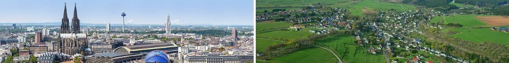

import Grid from '@material-ui/core/Grid'
import Container from '@material-ui/core/Container'
import BodyText from '../../components/BodyText'
import { ScrollyMap, ScrollyMapStep } from './ScrollyMap'
import SimpleMap from './SimpleMap'

<Container maxWidth="lg">
<BodyText>

// gif? Pyramide: Land, Bundesländer, Regierungsbezirke, Landkreise, Gemeinden

Bei der Suche nach amtlichen Daten für eine Region begegnen dir oft Begriffe wie 'regionale Tiefe', 'Nuts-Level' oder 'Lau'. Dabei geht es um die Einteilung und Vergleichbarkeit von Gebieten. Wo gibt es die meisten Kühe? Wer erzeugt den meisten Müll? Um diese Fragen beantworten zu können, müssen wir ähnliche und gleichbleibende Gebiete miteinander vergleichen können.

In Deutschland sind das Bundesländer, Landkreise, Gemeinden - dazu kommen Sonderfälle wie Stadtstaaten (Hamburg, Bremen, Berlin) oder Regierungsbezirke, die es nur in einigen Bundesländern gibt. Auf dieser Grundlage teilt die EU europäische Gebiete in drei Stufen ein: Nuts-1 bis Nuts-3. So werden Regionen auch über Grenzen hinweg vergleichbar.

Wir zeigen dir die Einteilung und ihre Sonderfälle für Deutschland, damit du dich schnell in den Regionaldaten zurecht findest.

</BodyText>
</Container>

<ScrollyMap>

<!-- -------------------------- Step 1: NUTS 1 -------------------------- -->

<ScrollyMapStep id="nuts1">

### Bundesländer - NUTS-1

In Deutschland sind die NUTS-1-Regionen die 16 Bundesländer. Die Bevölkerung
einer NUTS-1-Region liegt in aller Regel zwischen 3 und 7 Millionen
Einwohnern.

Nordrhein-Westfalen das Bundesland, in dem Altena liegt, ist das bevölkerungsreichste Bundesland.

</ScrollyMapStep>

<!-- -------------------------- Step 2: NUTS 2 -------------------------- -->

<ScrollyMapStep id="nuts2">

### Regierungsbezirke - NUTS-2

Weniger eindeutig sind in Deutschland die NUTS-2 Regionen besetzt. In NRW sind das Regierungsbezirke. Die gibt es aber nicht in allen Bundesländern.

### Statistische Regionen

Altena im Märkischen Kreis gehört zum Regierungsbezirk Arnsberg. Das ist einer der fünf Regierungsbezirke in Nordrhein-Westfalen.

</ScrollyMapStep>

<!-- -------------------------- Step 3: NUTS 3 -------------------------- -->

<ScrollyMapStep id="nuts3">

### Landkreise

Gemeinden sind in Deutschland in **Landkreisen** zusammengefasst. Altena bildet gemeinsam mit umliegenden Gemeinden den Märkischen Kreis, einen von 53 Landkreisen in NRW. In der EU wird diese Ebene als NUTS-3 bezeichnet. NUTS-3-Regionen sind kleinere Verwaltungseinheiten, die in der Regel zwischen 150.000 und 800.000 Einwohnern haben.

Der Märkische Kreis besteht beispielsweise aus 15 Gemeinden und hat insgesamt 410.000 Einwohner. Mehr als die Hälfte der Einwohner lebt in den drei bevölkerungsreichsten Gemeinden des Kreises. Das sind die Städte Iserlohn, Lüdenscheid und Menden.

</ScrollyMapStep>

<!-- --------------------------- Step 4: LAU ---------------------------- -->

<ScrollyMapStep id="lau">

### Die kleinsten Einheiten: Gemeinden

Die Grundbausteine der regionalen Einteilung bilden in Deutschland rund 11.000 **Gemeinden**. In der EU werden diese kleinsten Einheiten als **LAU**, Local Administrative Units, also lokale Verwaltungseinheiten bezeichnet. Das Bundesland Nordrhein-Westfalen zum Beispiel, hier auf der Karte zu sehen, besteht aus 396 Gemeinden.

<small>

#### Die größte und kleinste Gemeinde

Die größte Gemeinde in Nordrhein-Westfalen ist Köln mit über einer Million Einwohnern. Die kleinste Gemeinde ist Dahlem in der Nordeifel. Dort leben nur 4.200 Menschen. Mit 44 Einwohner je km2 ist Dahlem auch die Gemeinde mit der geringsten Bevölkerungsdichte in Nordrhein-Westfalen.

- [Alle Daten zu Köln](/)
- [Alle Daten zu Dahlem](/)

</small>

</ScrollyMapStep>

<ScrollyMapStep id="lau-local">

### Ein Beispiel: Die Gemeinde Altena

Altena ist eine Kleinstadt in Nordrhein-Westfalen. Mit knapp 17.000 Einwohnern und 381 Einwohnern pro
Quadratkilometer liegt sie im Mittelfeld der Gemeinden in NRW.

<small>

- [Alle Daten zur Gemeinde Altena](/)
- [Alle Daten zum Märkischen Kreis](/)

</small>

</ScrollyMapStep>

</ScrollyMap>

<Container maxWidth="lg">
<BodyText>

## Weniger Gemeinden

In Deutschland geht die Zahl der Gemeinden seit über 20 Jahren immer weiter zurück.

// https://www.datawrapper.de/_/JYU8f/
// https://tabular.genesapi.org/?region=DG&data=11111%3AGEM001

Regionale Einteilungen verändern sich immer wieder, am häufigsten ändern sich Gemeinden. Den aktuellen Stand kann man [hier abrufen](https://www.destatis.de/DE/Themen/Laender-Regionen/Regionales/Gemeindeverzeichnis/_inhalt.html).

## Große Unterschiede

Während Rheinland-Pfalz bei der Zahl der Einwohner nur an sechster Stelle steht, ist es aber das Land mit den meisten Gemeinden in Deutschland:
// https://www.datawrapper.de/_/JNe0o/
Wobei 96 Städte und 2.165 Ortsgemeinden sich zu 129 Verbandsgemeinden zusammengeschlossen haben, die für die angehörenden Gemeinden die Verwaltungsgeschäfte übernehmen.

## NUTS: Wichtig für die EU-Förderung

NUTS steht für "Nomenclatur of Territorial Units for Statistics". (Einteilung von Gebieten für statistische Zwecke.) Für die Regionen in der EU ist die Gebiets-Einteilung wichtig, weil sie Vergleiche und Rankings möglich macht. Welche Regionen liegen unter oder über dem EU-Durchschnitt? Welche Region liegt vorn oder hängt hinterher? Und: NUTS-Level spielen für die Regionalpolitik eine wichtige Rolle: Denn EU-Fördermittel werden konkreten NUTS-Regionen (vor allem NUTS-3-Regionen) zugewiesen.

## Unterschiede und Sonderfälle

Trotz des Ziels auf einer NUTS-Ebene Regionen vergleichbarer Größe zu schaffen, können sich diese deutlich in Bezug auf ihre Fläche, Bevölkerungszahl und ihrer wirtschaftlichen oder verwaltungstechnischen Bedeutung unterscheiden. Luxemburg ist zum Beispiel gleichzeitig NUTS-Ebene 1, 2 und 3.

In Nordrhein-Westfalen gibt es 17.364.000 Einwohner aufgeteilt in 396 politisch selbstständige Gemeinden, 53 Landkreise und kreisfreie Städte und 5 Regierungsbezirke. Im Vergleich dazu hat Mecklenburg-Vorpommern nur 1.609.675 Einwohner in 726 politisch selbstständige Gemeinden, dafür gibts es aber nur 8 Landkreise und Kreisfreie Städte. Und keine Regierungsbezirke.

### Gleichzeitig NUTS-1 und NUTS-2

In NRW, Baden-Württemberg, Bayern, Hessen gibt es Regierungsbezirke. In Rheinland-Pfalz, Niedersachsen und Sachen wurden diese Regierungsbezirke aufgelöst. 9 weitere Länder sind gleichzeitig NUTS-1- und NUTS-2-Regionen: Die „Stadtstaaten“ Berlin, Hamburg und Bremen, sowie die „Flächenländer“ Brandenburg, Mecklenburg-Vorpommern, Schleswig-Holstein, Sachsen-Anhalt, Saarland und Thüringen.

// Deutschlandkarte - Nuts 1 und Nuts 2 nebeneinander

<Grid container direction="row" justify="center" spacing={2}>
  <Grid item xs={12} sm={6}>
    <SimpleMap
      latitude={51.427}
      longitude={7.664}
      src="/geo/bundeslaender.json"
      width="100%"
      height="400px"
    />
  </Grid>

## Brandenburg

Brandenburg wurde von 2003 bis 2011 in die NUTS-2-Regionen Brandenburg-Nordost und Brandenburg-Südwest geteilt, in der Absicht, nach der EU-Erweiterung vom 1. Mai 2004 wenigstens noch für den ärmeren Nordosten weiterhin EU-Fördergelder zugewiesen zu bekommen.

// Karte Brandenburg

## Berlin (anders als Bremen, Hamburg)

Sonderfälle Einteilung Bezirke

  <Grid item xs={12} sm={6}>
    <SimpleMap
      latitude={51.427}
      longitude={7.664}
      src="/geo/nrw_landkreise.json"
      width="100%"
      height="400px"
    />
  </Grid>
</Grid>

<Grid container direction="row" justify="center" spacing={2}>
  <Grid item xs={12} sm={6}>
    <SimpleMap
      latitude={51.427}
      longitude={7.664}
      src="/geo/nrw_gemeinden.json"
      width="100%"
      height="400px"
    />
  </Grid>
  <Grid item xs={12} sm={6}>
    <SimpleMap src="/geo/bundeslaender.json" width="100%" height="400px" />
  </Grid>
</Grid>

### Credits

Bild Altena: https://de.wikipedia.org/wiki/Altena#/media/Datei:Altena_(Burg_Altena)_04_ies.jpg
Bild Köln: https://de.wikipedia.org/wiki/K%C3%B6ln#/media/Datei:Stadtbild_K%C3%B6ln_(50MP).jpg
Bild Dahlem: https://de.wikipedia.org/wiki/Dahlem_(Nordeifel)#/media/Datei:Dahlem_(Nordeifel)_001x.jpg

</BodyText>
</Container>
