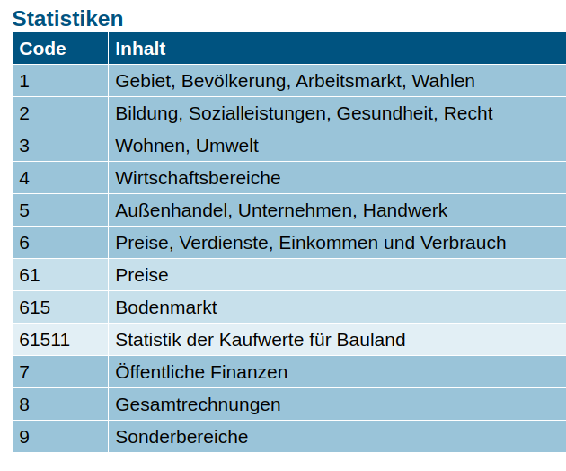
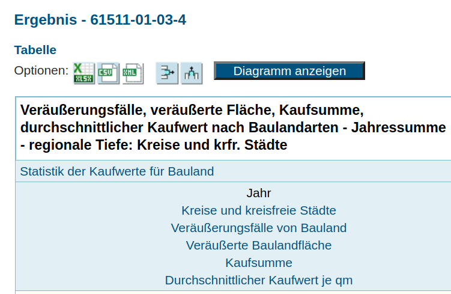
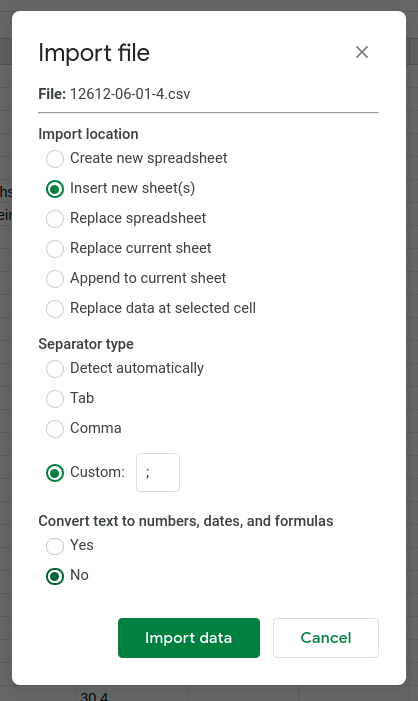
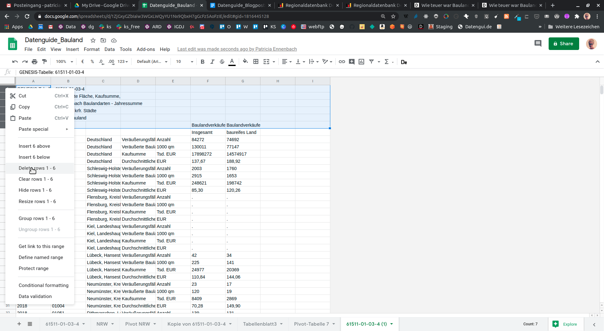
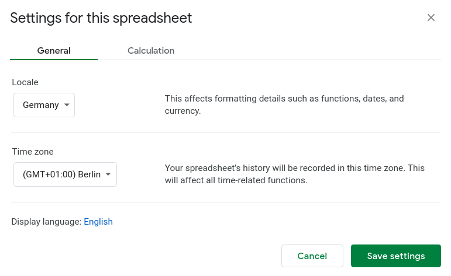
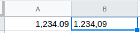
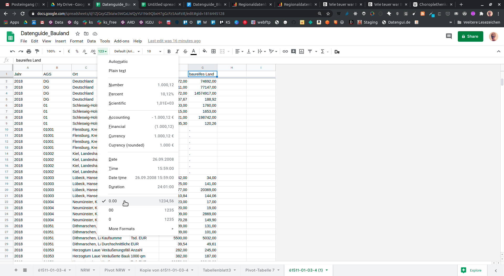
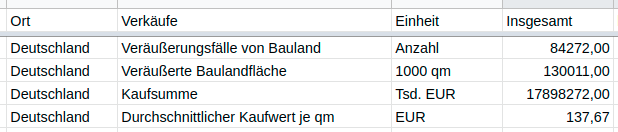
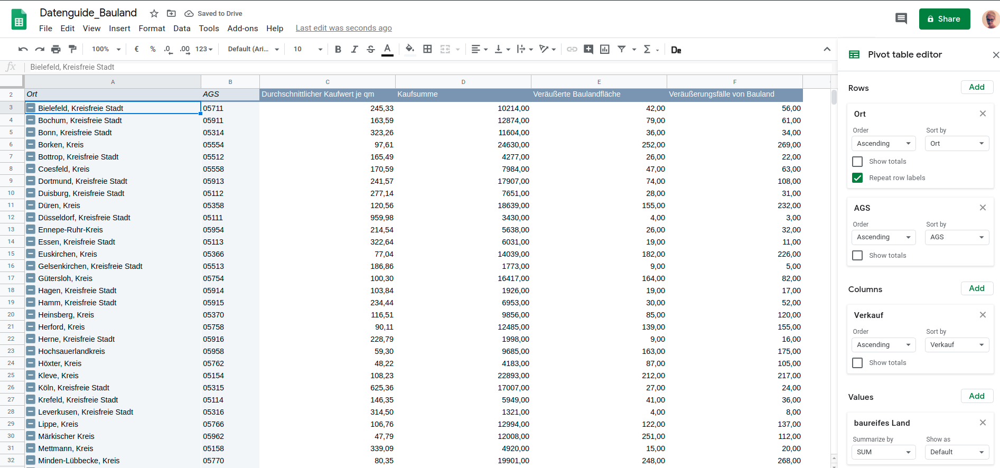
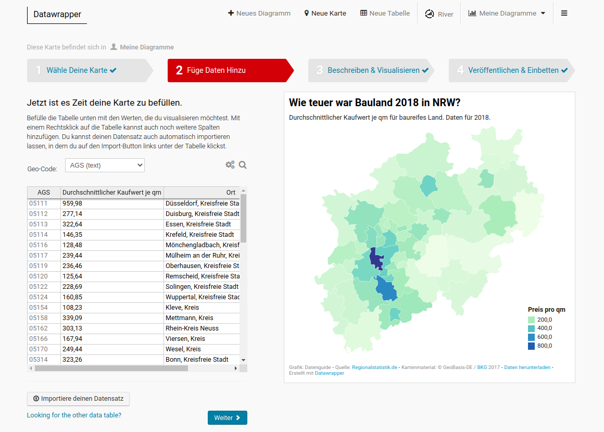

import Grid from '@material-ui/core/Grid'
import Container from '@material-ui/core/Container'
import BodyText from '../../components/BodyText'
import DatawrapperChart from '../../components/DatawrapperChart.js'

<Container maxWidth="lg">
  <BodyText>

## Regionalstatistik visualisieren, aber wie?

Auf dem Weg zur ersten Datenvisualisierung liegen einige Hürden: Amtliche Daten müssen oft bearbeitet werden, damit du sie in Visualisierungstools wie zum Beispiel dem Datawrapper benutzen kannst. Wir zeigen dir, wie man Daten aus der amtlichen Statistik auf eine Karte bringt. Diese Technik kannst du auch für jede andere Visualisierung verwenden, in der verschiedene Regionen verglichen werden.

Amtliche Daten können journalistischen Berichten mehr Tiefe geben. Statt Einzelfälle und Zitate aneinanderzureihen, bieten Daten die Möglichkeit, ein größeres Bild sichtbar zu machen.

Auf dieser Karte ist zum Beispiel zu sehen, wie teuer Bauland in Nordrhein-Westfalen im Jahr 2018 war:

<DatawrapperChart
  alt="Alt-Text"
  title=""
  src="https://datawrapper.dwcdn.net/IJwst/1/"
/>

### Welche Schritte sind nötig, um zu dieser Karte zu kommen?

#### 1. Daten als .csv herunterladen

Suche auf regionalstatistik.de nach ‘Bauland’ oder direkt nach der Nummer der Tabelle: 61511-01-03-4. Lade die Daten als .csv herunter.

#### 2. Kopf- und Fußzeilen löschen, Kopfzeile neu beschriften

Importiere die .csv in der Tabellenkalkulation deiner Wahl (Excel, LibreOffice, GoogleSheets). Wir zeigen den Prozess am Beispiel von GoogleSheets.
Achtung beim Import: Die .csv verwendet ‘;’ als Trennzeichen. Das musst du beim Import angeben. Lösche dann händisch die Zeilen über den Daten ( Header) und unter den Daten (Footer).

Danach beschriftest Du die erste Zeile neu und legst sie als Kopfzeile fest.

#### 3. Entscheiden, was visualisiert werden soll

Vor Dir siehst du eine recht verschachtelte Tabelle. Sie ist gut geeignet, um auf DIN-A4-Seiten ausgedruckt zu werden, ein Visualisierungstool wie Datawrapper ist damit jedoch überfordert. Um eine Flächenwert-Stufen-Karte (Choroplethenkarte) zu erstellen, musst Du zwei Entscheidungen treffen:

1. Welche regionale Ebene möchtest du darstellen? In diesem Fall möchten wir Kreise in Nordrhein-Westfalen zeigen.
2. Nach welchem Merkmal soll die Karte eingefärbt werden? Um Vergleichbarkeit herzustellen, möchten wir die Kreise anhand des durchschnittlichen Kaufwert je qm einfärben.

#### 4. Datentypen bereinigen

Um mit Zahlenwerten arbeiten zu können, müssen sie von der Tabellenkalkulation als ‘Nummer’ erkannt werden. Stelle dazu in Google Sheets die Verortung (locale) auf ‘Germany’ um.

Denn deutsche und amerikanische Schreibweise von Zahlen unterscheiden sich:

Dann wählst du für die Spalten ‘Insgesamt’ und ‘baureifes Land’ als Nummernformat 0.00 aus. Dadurch bekommst Du Werte ohne Tausendertrennzeichen, mit zwei Stellen nach dem Komma, wie für Euro-Beträge üblich. (Das Format ist nicht für alle Verkaufsarten optimal, aber für den Kaufpreis pro qm gut geeignet.)

#### 5. Regionale Ebene auswählen

Da amtliche Gemeindeschlüssel (AGS) mit einer führenden 0 beginnen, erfordert das Herausfiltern der richtigen regionalen Ebene etwas Handarbeit. Wähle alle Daten aus, deren AGS mit 05 anfangen und kopiere diese Daten in ein neues Tabellenblatt ‘NRW’. Dann lösche händisch alle Daten, deren AGS weniger als 4 Stellen lang ist. So fallen Daten für NRW gesamt und für die Regierungsbezirke raus. Übrig bleibt nur die Kreisebene.

#### 6. Pivot Tabelle: Aus long wird wide

Schaut man sich die Tabelle an, dann sieht man, dass unsere Tabelle noch nicht ganz für ein Visualisierungstool bereit ist . Denn unter ‘Verkäufe’ sind verschiedene Typen zusammengefasst, so dass es für jeden Ort vier Spalten in den Daten gibt:

Diese Form nennt man ‘long’. Solche langen Tabellen eignen sich, um viele Variablen auf engem Raum darzustellen.
Die Karte im Datawrapper stellt jedoch nur zwei Dinge dar: Flächen (Orte) werden anhand eines Wertes (Kaufpreis je qm) eingefärbt. Deshalb müssen wir dafür sorgen, dass es für ‘Kaufpreis je qm’ eine eigene Spalte gibt.

Dazu klickst Du unter ‘Data’ auf ‘Pivot Table’. Und wählst dann als Rows ‘Ort’ und ‘AGS’ aus, als Columns ‘Verkauf’ und als Values ‘baureifes Land’.

Die Daten werden entsprechend umsortiert:

#### 7. Karte in Datawrapper bauen

In Datawrapper wählst Du NRW Landkreise als neue Karte aus, fügst dann die Daten ein und wählst die entsprechenden Spalten aus (AGS und Durchschnittlicher Kaufwert je qm).
Danach kannst Du die Karte beschriften, deine Datenquelle angeben und die Karte und Tooltips, Legende etc. nach deinen Wünschen gestalten. Am Schluss auf veröffentlichen klicken.

  </BodyText>
</Container>
