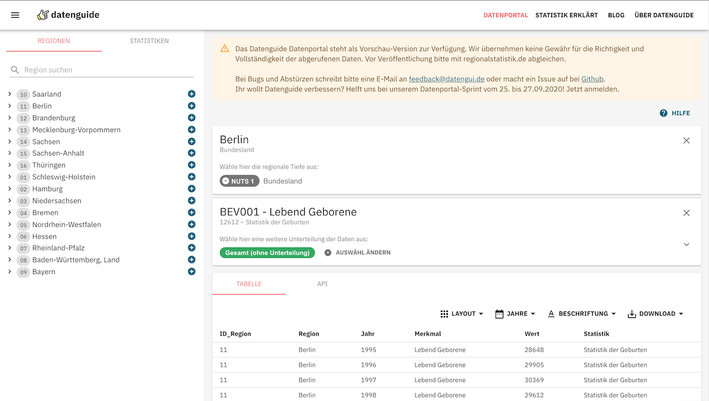

import Grid from '@material-ui/core/Grid'
import Container from '@material-ui/core/Container'
import { BodyText } from '../../components/BodyText'
import ArrowLink from '../../components/ArrowLink'
import StatisticsTree from './components/StatisticsTree'
import DimensionExplorable from './components/DimensionExplorable'

<Container maxWidth="lg">
  <BodyText>

Welche Daten gibt es überhaupt in der Regionalstatistik? Wie kriege ich das raus und wie frage ich das ab?
Was sind 'Merkmale' und 'Merkmalsausprägungen'? Wir haben uns das mal genauer angeschaut.

## Statistiken und Wertmerkmale

Die Regionalstatistik ist eine Sammlung von Statistiken, die Vergleiche zwischen Bundesländern und Regionen ermöglichen.
Diese Statistiken werden im Auftrag der Statistischen Ämter des Bundes und der Länder zur Verfügung gestellt.
Eine Statistik enthält mehrere, sogenannte 'Wertmerkmale'. Das kann man als verschiedene Werte verstehen, die thematisch
in einer Statistik zusammengefasst sind. So enthält zum Beispiel die Statistik 'Feststellung des Gebietsstandes' die Wertmerkmale
'Zahl der Gemeinden' und 'Gebietsfläche'. Wertmerkmale werden auch 'measures' genannt.

<StatisticsTree />

## Räumliche Gliederung

Statistiken sind auf verschiedenen 'regionalen Tiefen' verfügbar. So gibt es die Ebenen Deutschland gesamt, Bundesländer (NUTS 1),
Regierungsbezirke (NUTS 2), Kreise und kreisfreie Städte (NUTS 3) und Gemeinden (LAU).
Mehr zur Einteilung von statistischen Regionen in Deutschland (NUTS) erfährst Du [hier](/statistik-erklaert/nuts).

## Sachliche Gliederung

Die Daten sind weiter nach sogenannten 'sachlichen Merkmalen' gegliedert. Sachliche Merkmale können beispielsweise Nationalität,
Schulabschluss, Altersgruppe, Geschlecht etc. sein. Statistiken können oft in verschiedenen Kombinationen dieser sachlichen Merkmale
abgefragt werden, zum Beispiel nach Geschlecht und Nationalität oder nur nach Nationalität oder nach Geschlecht und Altersgruppe.
Sachliche Merkmale werden auch 'dimensions' genannt.

## Welche Kombinationen gibt es?

Welche Kombinationsmöglichkeiten es gibt, ist nicht auf den ersten Blick ersichtlich. Deshalb haben wir das analysiert und ein Tool
dafür gebaut.
**Finde heraus, welche Merkmale in einer Statistik kombiniert werden können!**

<DimensionExplorable />

## Das Datenguide Datenportal

Auf diesen Grundlagen haben wir ein neues Datenguide Abfrage-Tool entwickelt, das Datenguide Datenportal.

Eine erste Preview Version davon gibt es hier:

<ArrowLink href="https://preview.datengui.de/statistiken">
  Datenguide Datenportal
</ArrowLink>

  </BodyText>
</Container>
