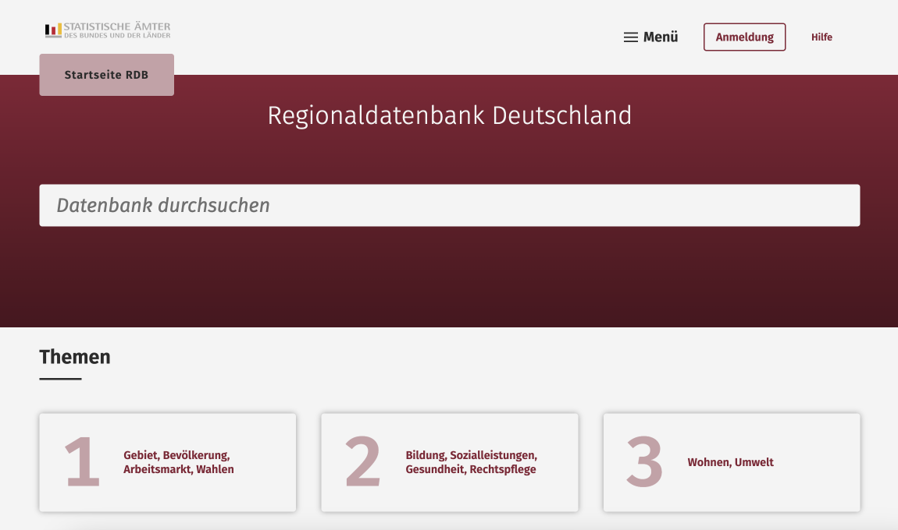
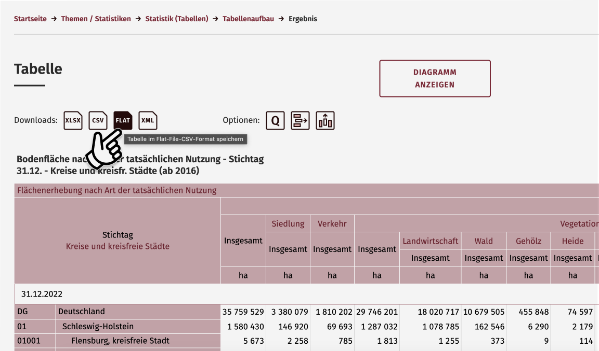

import ArrowLink from '../../components/ArrowLink'

Inhalt:

1. [Grundsätzliches Vorgehen](#grundsätzliches-vorgehen)
2. [Daten herunterladen und weiterverwenden („Flat&#8209;File&#8209;CSV“)](#so-lädst-du-daten-aus-genesis-herunter-und-verwendest-sie-weiter-flat-file-csv)
3. [Automatisierter Zugriff auf die GENESIS-API („Webservice“)](#so-kannst-du-den-zugriff-daten-aus-genesis-automatisieren-webservice)

## Hintergrund

GENESIS, das ist eine Software-Plattform, über die in Deutschland amtliche Statistiken veröffentlicht werden. Die Software wird von den statistischen Ämtern selbst entwickelt und dazu verwendet, verschiedene Datenportale zu betreiben. Dazu gehören beispielsweise das [offizielle Statistikportal des Statistischen Bundesamts](https://www-genesis.destatis.de/genesis/online) und die [Regionaldatenbank Deutschland](https://www.regionalstatistik.de/genesis/online/), ein Statistikportal, auf dem Daten zu Regionen veröffentlicht werden – also zu Bundesländern, Landkreisen, Städten und Gemeinden. Außerdem werden die Ergebnisse des Zensus über GENESIS-Portal veröffentlicht, die [Zensus-Datenbank](https://ergebnisse2011.zensus2022.de/datenbank/online/).

Diesen offiziellen Datenportalen haftete lange ein zweifelhafter Ruf an. Denn früher waren sie langsam, unübersichtlich und insgesamt nicht sehr nützlich für diejenigen, die diese Daten tatsächlich verwenden wollten, beispielsweise um eigene Grafiken oder Analysen zu erstellen. Das ist auch der Grund, warum das Projekt [Datenguide](https://datengui.de/) existiert. Unter diesem Namen haben wir seit 2018 an [Open-Source-Tools](https://github.com/datenguide/) gearbeitet, die es einfacher machen sollten, Daten aus GENESIS-Portalen herunterzuladen und weiter mit ihnen zu arbeiten.

Doch in den letzten Jahren hat sich einiges getan. Die Statistischen Ämter haben Feedback und Kritik ernst genommen und die GENESIS-Plattform kontinuierlich weiterentwickelt. Eine komplette Überarbeitung der Benutzeroberfläche kann aktuell als [Beta-Version](https://www-genesis.destatis.de/datenbank/beta/) getestet werden. Neben der neuen der Benutzeroberfäche gibt es auch Veränderungen auf technischer Seite. Seit einiger Zeit existiert eine API, über die auf die Datensätze zugegriffen werden kann (die „GENESIS-Webservice-Schnittstelle“), und ein neues Tabellenformat („Flat-File-CSV“) das es einfacher machen soll, die Daten weiter zu verwenden. Grund genug, GENESIS eine zweite Chance zu geben.

Im Rest dieses Artikels erklären wir, wie du die Daten der statistischen Ämter weiterverwenden kannst, zum Beispiel in Observable, Jupyter, oder R-Studio.

## Grundsätzliches Vorgehen

Wenn du nur einige wenige Datensätze nutzen möchtest, kannst du sie direkt über die Web-Oberfläche der verschiedenen GENESIS-Datenbanken herunterladen. Die Daten werden dort in Tabellenform angezeigt und können im CSV-Format abgerufen werden. Wenn du dagegen regelmäßig Daten aus GENESIS verwendest, oder wenn du die Daten automatisiert weiterverarbeiten möchtest, solltest du die GENESIS-API („Webservice“) nutzen. Diese API ermöglicht es, die Daten mit einer Programmiersprache wie R oder Python abzufragen und herunterzuladen.

<div style={{ borderRadius: '5px', background: '#f5f5f5', padding: '0.5em 1.5em', margin: '1em 0' }}>

### Eine Plattform – verschiedene Portale

GENESIS ist eine Plattform, mit der verschiedene Datenportale betrieben werden. Jedes der Datenportale hat einen thematischen oder regionalen Schwerpunkt und eine eigene Datenschnittstelle, die aber technisch weitgehend gleich funktionieren. Hier eine Liste der wichtigsten GENESIS-Portale:

- [Statistisches Bundesamt](https://www-genesis.destatis.de/genesis/online) – das offizielle Statistikportal für Daten die auf Bundesebene vorliegen
- [Regionaldatenbank Deutschland](https://www.regionalstatistik.de/genesis/online/) – Statistiken zu Bundesländern, Landkreisen, Städten und Gemeinden
- [Kommunale Bildungsdatenbank](https://www.bildungsmonitoring.de/bildung/online) – Statistiken zu Bildung und Schule
- [Zensus-Datenbank](https://ergebnisse2011.zensus2022.de/datenbank/online/) – Ergebnisse des Zensus 2022 (ab Sommer 2024)

Außerdem betreiben verschiedene Landesämter eigene GENESIS-Portale, über die detailliertere regionale Statistiken abgerufen werden können:

- [Statistisches Landesamt Nordrhein-Westfalen](https://www.landesdatenbank.nrw.de/ldbnrw/online)
- [Statistisches Landesamt Sachsen](https://www.statistik.sachsen.de/genonline/online)
- [Statistisches Landesamt Sachsen-Anhalt](https://genesis.sachsen-anhalt.de/genesis/online/)
- [Bayerisches Landesamt für Statistik](https://www.statistikdaten.bayern.de/genesis/online)

Auch die anderen Bundesländer haben eigene Datenportale, die allerdings nicht auf GENESIS basieren. Dort ist es ebenfalls möglich, Daten herunterzuladen, aber die technischen Details können von Land zu Land unterschiedlich sein.

</div>

## Daten herunterladen und weiterverwenden („Flat&#8209;File&#8209;CSV“)

Für diese Anleitung gehen wir davon aus, dass du einen Datensatz herunterladen möchtest um ihn dann mit einem Tool wie [Observable](https://observablehq.com/), [Jupyter](https://jupyter.org/), oder [R](https://www.r-project.org/) zu verwenden. Die Schritte sind:

1. Finde eine Tabelle in einem der GENESIS-Datenportale
2. Lade die Tabelle im Format „Flat-File-CSV“ herunter
3. Lese die CSV-Datei im korrekten Format ein (z.B. Zeichenkodierung, Zahlenformat)
4. Bringe die Tabelle in eine Form, mit der du weiterarbeiten kannst
5. Visualisiere die Daten oder nutze sie in deiner Analyse

Wir verwenden in diesem Beispiel die [Regionaldatenbank](https://www.regionalstatistik.de/genesis/online/), aber das grundsätzlichen Vorgehen ist für alle GENESIS-Portale gleich.



### Herunterladen eines Datensatzes

In der Regionaldatenbank findest du eine Vielzahl von Statistiken zu verschiedenen Themen. Jede Statistik besteht aus mehreren Tabellen. Wenn du eine Tabelle gefunden hast, die du verwenden möchtest, kannst du sie vor dem Download konfigurieren, zum Beispiel indem du bestimmte Regionen oder Zeiträume auswählst. In vielen Fällen kannst du die Daten dann direkt herunterladen. Bei umfangreicheren Datensätzen musst du dich allerdings anmelden, bevor du die Daten herunterladen kannst. Die [Registrierung](https://www.regionalstatistik.de/genesis/online?Menu=Registrierung#abreadcrumb) ist kostenlos.

Für die Verwendung der Daten in eigenen Grafiken oder Analysen ist in der Regel das Format _Flat_ („Flat-File-CSV“) am geeignetsten. In diesem Format sind die Tabellen nicht verschachtelt und jede Spalte einen eindeutigen Titel in der ersten Zeile der Tabelle. Dadurch ist es einfacher, die Daten in Tools wie [Observable](https://observablehq.com/), [Jupyter](https://jupyter.org/), oder [R](https://www.r-project.org/) zu laden.



### Einlesen der Daten

Nach dem Download der CSV-Datei lädst du sie in deiner Programmierumgebung. Das erste Problem: Im Gegensatz zum Rest des modernen Internets verwendet GENESIS nicht die Zeichenkodierung `utf-8`, den de-facto-Standard in modernen APIs. Stattdessen setzen die statistischen Ämter auf die Zeichenkodierung `windows-1252`. Damit soll wohl die Kompatibilität mit Software von Microsoft verbessert werden. Leider führt das auch dazu, dass Umlaute und andere Sonderzeichen in vielen anderen Tools nicht richtig dargestellt werden. Um solche Probleme zu vermeiden, musst du die Datei mit der korrekten Zeichenkodierung laden – also mit `windows-1252`.

Außerdem musst du darauf achten, dass die Spalten korrekt getrennt sind und Zahlen richtig eingelesen werden. GENESIS verwendet ein deutsches Zahlenformat, mit Kommas als Dezimaltrenner, und als CSV-Trennzeichen das Semikolon (;). Diese Einstellungen musst du beim Einlesen der Daten vornehmen, zum Beispiel in Python mit Hilfe von [pandas.read_csv](https://pandas.pydata.org/pandas-docs/stable/reference/api/pandas.read_csv.html):

```python
# Einlesen der Daten mit pandas (vereinfachtes Beispiel)
pd.read_csv(csv_input, delimiter=';', decimal=",")
```

Danach kannst du die Daten transformieren, um sie in das Format zu bringen, das du für deine Auswertung oder Visualisierung benötigst. In diesem [Observable-Notebook](https://observablehq.com/@sjockers/genesis-choroplethen) findest du ein komplettes Beispiel dafür, wie du Daten aus der Regionaldatenbank in Observable einlesen und visualisieren kannst. Ein Beispiel für Python findest du in dem Jupyter-Notebook, das am Ende des nächsten Kapitels verlinkt ist.

## Automatisierter Zugriff auf die GENESIS-API („Webservice“)

Wenn du regelmäßig Daten aus GENESIS herunterlädst, oder wenn du die Daten automatisiert weiterverarbeiten möchtest, solltest du die GENESIS-API („Webservice“) nutzen. Diese API ermöglicht es, Datensätze direkt mit einer Programmiersprache wie Python zu durchsuchen und herunterzuladen. Für die Nutzung der GENESIS-API ist eine Registrierung auf dem jeweiligen Datenportal notwendig.

Die GENESIS-API ist eine REST-Schnittstelle, die Antworten im JSON-Format zurückgibt. Allerdings sind die eigentlichen Daten, die über die API abgefragt werden, nicht mittels JSON kodiert sondern werden in den gleichen Formaten zurückgegeben wie in der oben beschriebenen Web-Oberfläche, zum Beispiel als „Flat-File-CSV“. JSON wird nur für die Metadaten verwendet. Der Zugriff auf die Inhalte der Tabellen erfolgt auf die gleiche Art und Weise, die du auch für den manuellen Download der Daten verwenden würdest.

Über die API kannst du, wie in der Web-Oberfläche, nach Datensätzen suchen, sie konfigurieren und herunterladen. Hier ein einfaches Beispiel, wie du mit Python Daten aus der Regionaldatenbank herunterladen kannst:

```python
# Suche nach Statistiken für den Suchbegriff „Inflation“
search = requests.get(BASE_URL + 'find/find', params={
    'username': USERNAME,
    'password': PASSWORD,
    'language': 'de',
    'term': 'Inflation'
})

# Anzeigen der Suchergebnisse als DataFrame:
pd.DataFrame.from_dict(search_results['Tables']).head(5)

#	  Code	      Content
# =============================================================
# 0	61111-0001	Verbraucherpreisindex: Deutschland, Jahre
# 1	61111-0002	Verbraucherpreisindex: Deutschland, Monate
# 2	61111-0003	Verbraucherpreisindex: Deutschland, Jahre, ...
# 3	61111-0004	Verbraucherpreisindex: Deutschland, Monate, ...
# 4	61111-0005	Verbraucherpreisindex: Deutschland, Jahre, ...
# 5	61111-0006	Verbraucherpreisindex: Deutschland, Monate, ...
```

Anhand der Suchergebnisse kannst du den Code der Tabelle ermitteln, die du herunterladen möchtest. Das folgende Beispiel zeigt, wie du die Daten der Tabelle im Flat-File-CSV (`ffcsv`) herunterladen kannst. Die Weiterverarbeitung der Daten erfolgt dann wie im vorherigen Abschnitt beschrieben.

```python
# Herunterladen eines Datensatzes aus der Regionaldatenbank Deutschland
response = requests.get(BASE_URL + 'data/tablefile', params={
    'username': USERNAME,
    'password': PASSWORD,
    'name': '61111-0001',
    'area': 'all',
    'format': 'ffcsv', # Flat-File-CSV
    'language': 'de'
})
print(response.text)
```

Das Komplette Beispiel, inklusive der Authentifizierung und der Visualisierung der heruntergeladenen Daten, findest du in diesem [Jupyter-Notebook](https://github.com/sjockers/genesis-api-example/blob/main/genesis-api-example.ipynb). Für Nutzer:innen von R und Python gibt es außerdem inoffizielle Bibliotheken, die den Zugriff auf die GENESIS-API erleichtern. Das Python-Paket [pystatis](https://pypi.org/project/pystatis/) und das R-Paket [restatis](https://rdrr.io/cran/restatis/f/README.md) bieten Funktionen, um Daten aus GENESIS herunterzuladen und weiterzuverarbeiten. Der Vorteil dieser Pakete ist, dass sie die Authentifizierung und die Aufbereitung der Daten für dich übernehmen.

<ArrowLink href="https://github.com/sjockers/genesis-api-example/blob/main/genesis-api-example.ipynb">
  Vollständiges Beispiel (Jupyter Notebook)
</ArrowLink>
<ArrowLink href="https://www.regionalstatistik.de/genesis/online?Menu=Webservice#abreadcrumb">
  Offizielle Dokumentation der GENESIS-API
</ArrowLink>
<ArrowLink href="https://pypi.org/project/pystatis/">
  Python-Package für GENESIS
</ArrowLink>
<ArrowLink href="https://rdrr.io/cran/restatis/f/README.md">
  R-Package für GENESIS
</ArrowLink>

## Fazit

Die GENESIS-Plattform wurde in den letzten Jahren deutlich verbessert. Die Datenportale sind übersichtlicher und bieten bessere Möglichkeiten, die Daten weiterzuverwenden. Die Einführung der REST-API und des Tabellenformats „Flat-File-CSV“ sind wichtige Schritte, um die Daten der amtlichen Statistik besser zugänglich zu machen.

Auch wenn die GENESIS-Portale nicht perfekt sind, empfehlen wir inzwischen die Nutzung der offiziellen Schnittstellen. Die Daten sind dort aktuell und stammen direkt aus ihrer offiziellen Quelle. Das ist ein großer Vorteil gegenüber alternativen Datenquellen wie der Datenguide-API, [die wir zum 15. Juni 2024 abschalten werden](/blog/2024/bye-bye).
